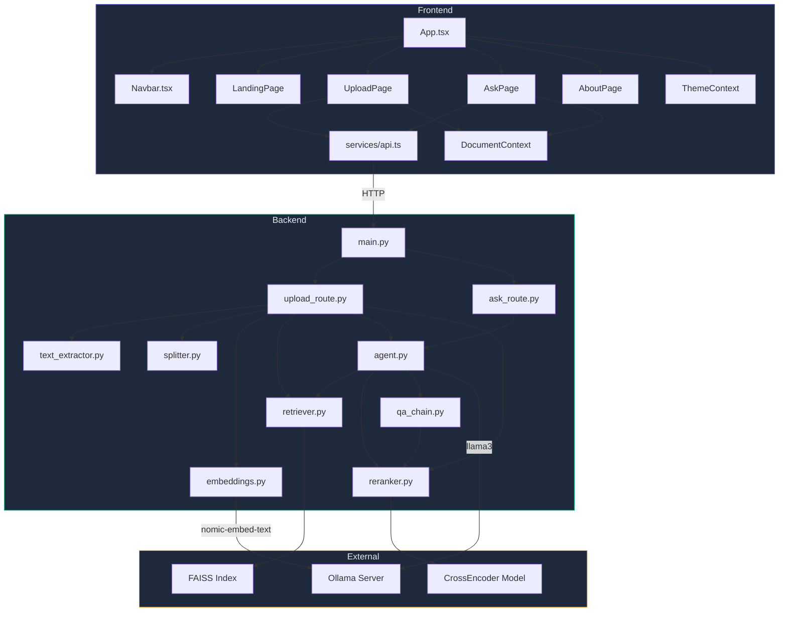

<div align="center">

# 🏗️ AskMe — System Architecture

[](#backend)
[](#frontend)
[](#agent--orchestration)
[](#llm-layer)

</div>

---

## 📐 High-Level Overview

```
┌──────────────────────────────────────────────────────────────────┐
│                        USER (Browser)                            │
│                   React 19 + TypeScript + Vite                   │
│  ┌────────────┐  ┌────────────┐  ┌──────────┐  ┌─────────────┐  │
│  │ LandingPage│  │ UploadPage │  │ AskPage  │  │  AboutPage  │  │
│  └────────────┘  └─────┬──────┘  └────┬─────┘  └─────────────┘  │
│                        │              │                          │
│                   uploadDocument  askQuestion                    │
│                   (services/api.ts)                              │
└────────────────────────┼──────────────┼──────────────────────────┘
                         │  HTTP/REST   │
                         ▼              ▼
┌────────────────────────────────────────────────────────────────────┐
│                     FastAPI Backend (main.py)                      │
│                     CORS: allow_origins=["*"]                     │
│                                                                    │
│   ┌─────────────────────┐     ┌──────────────────────┐            │
│   │  POST /api/upload   │     │   GET /api/ask       │            │
│   │  (upload_route.py)  │     │   (ask_route.py)     │            │
│   │                     │     │                      │            │
│   │  1. Save file       │     │  1. Get global agent │            │
│   │  2. Extract text    │     │  2. agent.invoke()   │            │
│   │  3. Chunk text      │     │  3. Return answer    │            │
│   │  4. Generate embeds │     │                      │            │
│   │  5. Build indexes   │     └──────────┬───────────┘            │
│   │  6. Create agent    │                │                        │
│   │  7. Pre-load reranker│               │                        │
│   └──────────┬──────────┘                │                        │
│              │                           │                        │
│              ▼                           ▼                        │
│   ┌──────────────────────────────────────────────────────┐        │
│   │              CORE ENGINE (backend/core/)              │        │
│   │                                                      │        │
│   │  ┌──────────────────┐    ┌────────────────────────┐  │        │
│   │  │  text_extractor  │    │       agent.py         │  │        │
│   │  │  .pdf → PdfReader│    │   ReAct Agent          │  │        │
│   │  │  .txt → read()   │    │   ┌────────────────┐   │  │        │
│   │  └────────┬─────────┘    │   │ Tool: FAISS    │   │  │        │
│   │           ▼              │   │ Tool: BM25     │   │  │        │
│   │  ┌──────────────────┐    │   │ Tool: Reranker │   │  │        │
│   │  │    splitter.py   │    │   └────────────────┘   │  │        │
│   │  │ RecursiveChar    │    └────────────┬───────────┘  │        │
│   │  │ chunk=1500       │                │               │        │
│   │  │ overlap=100      │                ▼               │        │
│   │  └────────┬─────────┘    ┌────────────────────────┐  │        │
│   │           ▼              │     qa_chain.py        │  │        │
│   │  ┌──────────────────┐    │  Fallback pipeline:    │  │        │
│   │  │  embeddings.py   │    │  retrieve → rerank →   │  │        │
│   │  │  nomic-embed-text│    │  generate              │  │        │
│   │  └────────┬─────────┘    └────────────────────────┘  │        │
│   │           ▼                                          │        │
│   │  ┌──────────────────┐    ┌────────────────────────┐  │        │
│   │  │  retriever.py    │    │     reranker.py        │  │        │
│   │  │  FAISS (semantic)│◄──►│  CrossEncoder          │  │        │
│   │  │  BM25  (keyword) │    │  ms-marco-MiniLM-L-6  │  │        │
│   │  └──────────────────┘    └────────────────────────┘  │        │
│   └──────────────────────────────────────────────────────┘        │
│                                                                    │
│   ┌──────────────────────────────────────────────────────┐        │
│   │              CONFIG (utils/config.py)                 │        │
│   │  EMBED_MODEL = "nomic-embed-text"                    │        │
│   │  LLM_MODEL   = "llama3"                             │        │
│   │  CHUNK_SIZE  = 1500  |  CHUNK_OVERLAP = 100          │        │
│   │  RETRIEVER_TOP_K = 10 | BM25_TOP_K = 10             │        │
│   │  RERANK_TOP_K = 3                                    │        │
│   │  CROSS_ENCODER = "cross-encoder/ms-marco-MiniLM-L-6-v2"     │
│   └──────────────────────────────────────────────────────┘        │
└────────────────────────────────────────────────────────────────────┘
                         │              │
                         ▼              ▼
              ┌─────────────────┐  ┌──────────────────┐
              │  FAISS Index    │  │  Ollama (Local)   │
              │  (In-Memory)    │  │  ┌──────────────┐ │
              │  Vector Store   │  │  │ llama3       │ │
              └─────────────────┘  │  │ nomic-embed  │ │
                                   │  └──────────────┘ │
                                   └──────────────────┘
```

---

## 🔄 Data Flow Diagrams

### 📤 Upload Pipeline

```
User selects file (.pdf / .txt)
        │
        ▼
┌─────────────────────┐
│  Frontend            │
│  UploadPage.tsx      │
│  POST /api/upload    │
│  (FormData)          │
└─────────┬───────────┘
          │
          ▼
┌─────────────────────────────────────────────────────┐
│                   upload_route.py                     │
│                                                       │
│  ① Save file → uploads/{filename}                    │
│                    │                                  │
│  ② text_extractor.extract_text_from_file()           │
│     ├── .pdf → PdfReader (pypdf)                     │
│     └── .txt → open().read()                         │
│                    │                                  │
│  ③ splitter.split_text()                             │
│     └── RecursiveCharacterTextSplitter               │
│         chunk_size=1500, overlap=100                  │
│                    │                                  │
│  ④ embeddings.get_embeddings()                       │
│     └── OllamaEmbeddings("nomic-embed-text")         │
│                    │                                  │
│  ⑤ retriever.build_vectorstore()                     │
│     ├── FAISS.from_documents() → vector index        │
│     └── BM25Okapi(tokenized) → keyword index         │
│                    │                                  │
│  ⑥ agent.create_agent(retriever)                     │
│     └── ReAct Agent with 3 tools                     │
│                    │                                  │
│  ⑦ reranker.get_cross_encoder()                      │
│     └── Pre-load CrossEncoder model                  │
│                                                       │
│  Return: { message, chunks, time_taken }             │
└─────────────────────────────────────────────────────┘
```

### ❓ Query Pipeline (Agent-Driven)

```
User types question
        │
        ▼
┌────────────────────┐
│  Frontend           │
│  AskPage.tsx        │
│  GET /api/ask       │
│  ?query=...         │
└─────────┬──────────┘
          │
          ▼
┌───────────────────────────────────────────────────────────────┐
│                      ask_route.py                             │
│                                                               │
│  agent = get_agent()   (global singleton from upload)        │
│  result = agent.invoke({"input": query})                     │
│                                                               │
│  ┌───────────────────────────────────────────────────────┐   │
│  │              ReAct Agent Decision Loop                 │   │
│  │                                                       │   │
│  │  Thought: "I should search for relevant documents"    │   │
│  │      │                                                │   │
│  │      ▼                                                │   │
│  │  Action: search_faiss OR search_bm25                  │   │
│  │      │                                                │   │
│  │      ├── search_faiss(query)                          │   │
│  │      │   └── FAISS similarity search → top 10 docs    │   │
│  │      │                                                │   │
│  │      └── search_bm25(query)                           │   │
│  │          └── BM25 keyword scoring → top 10 docs       │   │
│  │      │                                                │   │
│  │      ▼                                                │   │
│  │  Observation: Retrieved document chunks               │   │
│  │      │                                                │   │
│  │      ▼                                                │   │
│  │  Thought: "I should rerank for accuracy"              │   │
│  │      │                                                │   │
│  │      ▼                                                │   │
│  │  Action: rerank_results(query)                        │   │
│  │      └── CrossEncoder scores all pairs                │   │
│  │      └── Returns top 3 by relevance                   │   │
│  │      │                                                │   │
│  │      ▼                                                │   │
│  │  Thought: "I now have enough context to answer"       │   │
│  │      │                                                │   │
│  │      ▼                                                │   │
│  │  Final Answer: Generated by Llama 3                   │   │
│  └───────────────────────────────────────────────────────┘   │
│                                                               │
│  Return: { query, answer, time_taken }                       │
└───────────────────────────────────────────────────────────────┘
```

---

## 🧩 Module Dependency Graph



---

## 📁 Directory Structure

```
AskMe/
│
├── 📄 README.md                    # Project overview & setup guide
├── 📄 ARCHITECTURE.md              # This file — system design docs
├── 📄 INTERVIEW.md                 # Interview-ready Q&A guide
│
├── 📂 backend/
│   ├── 📄 main.py                  # FastAPI app, CORS, route registration
│   ├── 📄 requirements.txt         # Python deps (21 packages)
│   ├── 📄 sample.txt               # Test document
│   │
│   ├── 📂 core/                    # ⚙️ RAG Engine
│   │   ├── 📄 text_extractor.py    # PDF/TXT → raw text
│   │   ├── 📄 splitter.py          # Text → chunks (RecursiveCharacter)
│   │   ├── 📄 embeddings.py        # Chunk → vectors (nomic-embed-text)
│   │   ├── 📄 retriever.py         # FAISS + BM25 dual retrieval
│   │   ├── 📄 reranker.py          # CrossEncoder reranking
│   │   ├── 📄 agent.py             # ReAct agent with tool orchestration
│   │   └── 📄 qa_chain.py          # Fallback QA pipeline
│   │
│   ├── 📂 routes/                  # 🛣️ API Endpoints
│   │   ├── 📄 upload_route.py      # POST /api/upload
│   │   └── 📄 ask_route.py         # GET /api/ask
│   │
│   ├── 📂 utils/                   # 🔧 Configuration
│   │   └── 📄 config.py            # All hyperparameters & model names
│   │
│   └── 📂 uploads/                 # 📁 Uploaded file storage
│
└── 📂 frontend/
    ├── 📄 App.tsx                   # Root component + routing
    ├── 📄 index.tsx                 # React DOM entry point
    ├── 📄 index.html                # HTML shell
    ├── 📄 types.ts                  # TypeScript type definitions
    ├── 📄 vite.config.ts            # Vite build configuration
    ├── 📄 package.json              # Node.js deps
    │
    ├── 📂 components/               # 🧱 Reusable UI
    │   ├── 📄 Navbar.tsx            # Navigation bar
    │   ├── 📄 Footer.tsx            # Footer component
    │   ├── 📄 ThemeToggle.tsx       # Dark/Light mode toggle
    │   └── 📄 icons.tsx             # SVG icon components
    │
    ├── 📂 pages/                    # 📄 Page Components
    │   ├── 📄 LandingPage.tsx       # Hero / home page
    │   ├── 📄 UploadPage.tsx        # File upload with drag & drop
    │   ├── 📄 AskPage.tsx           # Chat interface
    │   └── 📄 AboutPage.tsx         # About section
    │
    ├── 📂 services/                 # 🌐 API Layer
    │   └── 📄 api.ts                # uploadDocument() / askQuestion()
    │
    ├── 📂 contexts/                 # 🔗 State Management
    │   ├── 📄 DocumentContext.tsx    # Document upload state
    │   └── 📄 ThemeContext.tsx       # Dark/Light theme state
    │
    └── 📂 hooks/                    # 🪝 Custom Hooks
        └── 📄 useTheme.ts           # Theme hook
```

---

## ⚡ Key Design Decisions

| Decision | Choice | Rationale |
|----------|--------|-----------|
| **LLM Runtime** | Ollama (local) | 100% privacy, no API keys, no cost |
| **Agent Framework** | LangChain ReAct | Agent autonomously picks search strategy |
| **Dual Retrieval** | FAISS + BM25 | Semantic + keyword search covers all query types |
| **Reranking** | CrossEncoder (ms-marco-MiniLM) | Precision boost without heavy compute |
| **Chunking** | 1500 chars, 100 overlap | Balanced context window vs. granularity |
| **State Management** | Global singletons | Simple, single-user prototype; no DB needed |
| **Frontend Routing** | HashRouter | Works with static hosting (no server-side routing) |
| **Styling** | Tailwind CSS classes | Rapid UI development with dark mode support |

---

## 🔐 Security Notes

- CORS is set to `allow_origins=["*"]` — suitable for local dev only
- No authentication layer — single-user local tool
- File uploads are saved directly to `uploads/` — no sanitization beyond extension check
- All inference runs locally via Ollama — no data leaves the machine

---

<div align="center">

*Built by **Sanjay Muthuswamy** — AI Enthusiast & Innovator*

</div>
