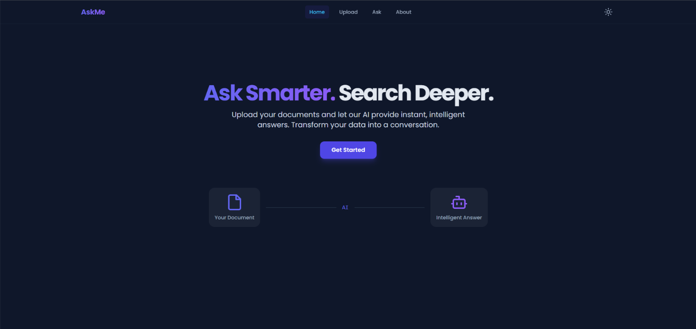
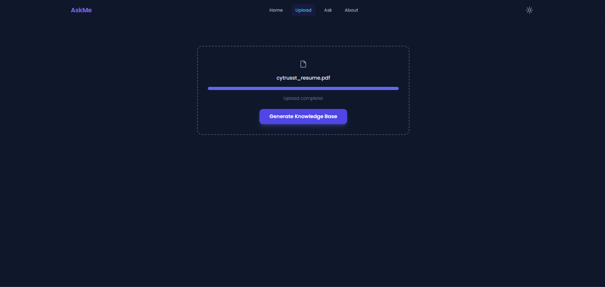
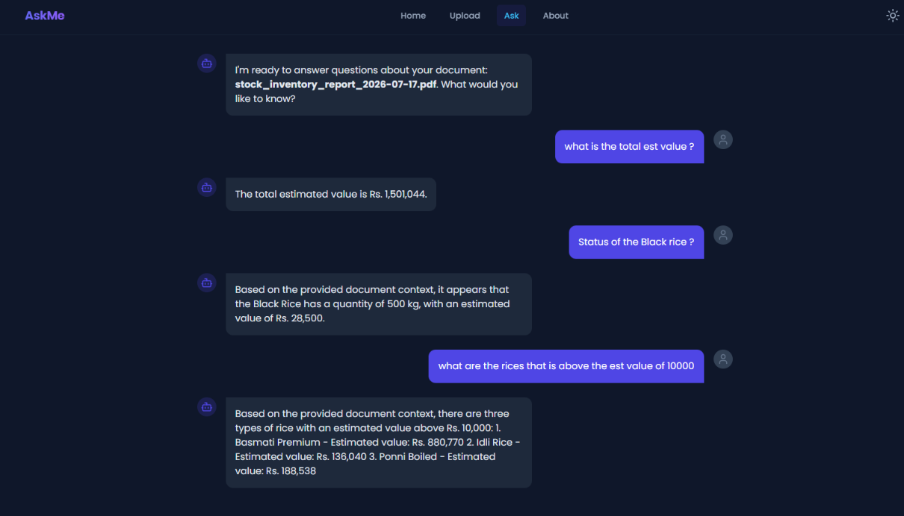
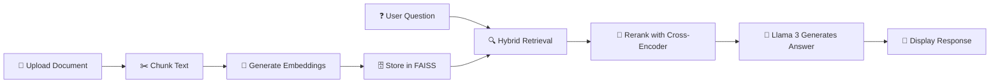

<div align="center">

# 🤖 AskMe

### AI-Powered Document Chat Assistant

[](https://www.python.org/)
[](https://fastapi.tiangolo.com/)
[](https://react.dev/)
[](https://www.typescriptlang.org/)
[](https://vitejs.dev/)
[](https://www.langchain.com/)
[](https://ollama.ai/)
[](LICENSE)

<br/>

> 📄 Upload documents. ❓ Ask questions. 💡 Get instant, context-aware answers — all running **locally** on your machine.

</div>

---

## ✨ Features

| | Feature | Description |
|---|---------|-------------|
| ⚡ | **RAG-based QA** | Retrieve contextually relevant answers using Retrieval-Augmented Generation |
| 🧠 | **Local LLM Integration** | Uses Ollama (Llama 3) for private, on-device inference |
| 🔍 | **Hybrid Search** | Combines FAISS vector search with BM25 keyword ranking |
| 🔀 | **Cross-Encoder Reranking** | sentence-transformers reranker for precision results |
| 💬 | **Interactive Chat UI** | Beautiful React + TypeScript conversational interface |
| 🪶 | **Lightweight & Fast** | Optimized chunking, embeddings, and local-first architecture |

---

## 🖼️ Application Screenshots

<div align="center">

### 1. Document Upload & Processing


<br/>

### 2. Context-Aware Q&A Chat Interface


<br/>

### 3. General Knowledge Fallback Integration


</div>

---

## 🏗️ Architecture

```
┌─────────────────────────────────────────────────────┐
│                    Frontend (React + TS)             │
│               Vite · React Router · Axios           │
└──────────────────────┬──────────────────────────────┘
                       │  REST API
┌──────────────────────▼──────────────────────────────┐
│                   Backend (FastAPI)                  │
│  ┌──────────┐  ┌───────────┐  ┌──────────────────┐  │
│  │ Upload   │  │  Ask      │  │  Core Engine     │  │
│  │ Route    │  │  Route    │  │  ┌────────────┐  │  │
│  └──────────┘  └───────────┘  │  │ Chunker    │  │  │
│                               │  │ Embedder   │  │  │
│                               │  │ Retriever  │  │  │
│                               │  │ Reranker   │  │  │
│                               │  └────────────┘  │  │
│                               └──────────────────┘  │
└──────────┬──────────────┬───────────────────────────┘
           │              │
   ┌───────▼───────┐  ┌──▼──────────────┐
   │  FAISS Index  │  │  Ollama (Local)  │
   │  Vector Store │  │  Llama 3 · Nomic │
   └───────────────┘  └─────────────────┘
```

---

## 🧰 Prerequisites

Before running **AskMe**, ensure the following are installed:

| Requirement | Link |
|-------------|------|
|  | [python.org](https://www.python.org/) |
|  | [nodejs.org](https://nodejs.org/) |
|  | [ollama.ai](https://ollama.ai/) |
|  | [git-scm.com](https://git-scm.com/) |

Then, pull the required Ollama models:

```bash
ollama pull llama3
ollama pull nomic-embed-text
```

---

## ⚙️ Installation

### 1️⃣ Clone the repository

```bash
git clone https://github.com/SanjayMuthuswamy/AskMe.git
cd AskMe
```

### 2️⃣ Backend Setup

```bash
cd backend
pip install -r requirements.txt
```

### 3️⃣ Frontend Setup

```bash
cd frontend
npm install
```

---

## ▶️ Running the App

### 🖥️ Start the Backend

```bash
cd backend
uvicorn main:app --reload
```

### 🌐 Start the Frontend

```bash
cd frontend
npm run dev
```

---

## 🛠️ Tech Stack

<table>
  <tr>
    <th>Layer</th>
    <th>Technology</th>
  </tr>
  <tr>
    <td><strong>⚙️ Backend</strong></td>
    <td>
      
      
      
    </td>
  </tr>
  <tr>
    <td><strong>🧠 LLM Engine</strong></td>
    <td>
      
      
    </td>
  </tr>
  <tr>
    <td><strong>🔗 Orchestration</strong></td>
    <td>
      
    </td>
  </tr>
  <tr>
    <td><strong>📊 Embeddings</strong></td>
    <td>
      
      
    </td>
  </tr>
  <tr>
    <td><strong>🗄️ Vector Store</strong></td>
    <td>
      
      
    </td>
  </tr>
  <tr>
    <td><strong>🎨 Frontend</strong></td>
    <td>
      
      
      
    </td>
  </tr>
</table>

---

## 🧩 How It Works



1. 📄 User uploads documents (PDF, TXT)
2. ✂️ Text is **split into chunks** and **embedded** using `nomic-embed-text`
3. 🗄️ Chunks are stored in a **FAISS vector database**
4. ❓ When a user asks a question:
   - 🔍 Relevant chunks are retrieved via **hybrid search** (FAISS + BM25)
   - 🎯 Results are **reranked** with a cross-encoder for precision
   - 🧠 Query + context are sent to **Llama 3**
   - 💬 The model generates an accurate, context-aware answer

---

## 📂 Project Structure

```
AskMe/
├── 📁 backend/
│   ├── 📁 core/           # Core RAG engine (chunker, embedder, retriever, reranker)
│   ├── 📁 routes/          # FastAPI route handlers (upload, ask)
│   ├── 📁 utils/           # Utility functions
│   ├── 📁 uploads/         # Uploaded document storage
│   ├── 📄 main.py          # FastAPI app entry point
│   └── 📄 requirements.txt # Python dependencies
├── 📁 frontend/
│   ├── 📁 components/      # React UI components
│   ├── 📁 pages/           # Page-level components
│   ├── 📁 services/        # API service layer
│   ├── 📁 hooks/           # Custom React hooks
│   ├── 📁 contexts/        # React context providers
│   ├── 📄 App.tsx          # Root application component
│   └── 📄 package.json     # Node.js dependencies
└── 📄 README.md
```

---

## 💡 Author

**Sanjay Muthuswamy** – AI Enthusiast & Innovator

[](https://github.com/SanjayMuthuswamy)

---

<div align="center">

⭐ **Star this repo if you found it useful!** ⭐

</div>
